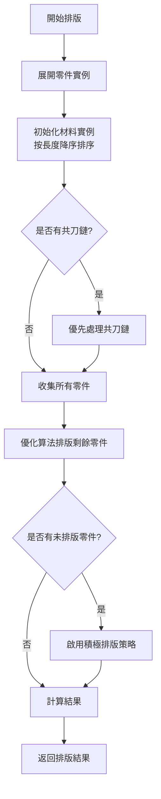

# 排版功能詳細邏輯文檔

## 目錄
1. [概述](#概述)
2. [整體流程架構](#整體流程架構)
3. [核心排版策略](#核心排版策略)
4. [材料選擇邏輯](#材料選擇邏輯)
5. [積極排版策略](#積極排版策略)
6. [共刀鏈處理](#共刀鏈處理)
7. [排版約束與計算](#排版約束與計算)
8. [結果統計與報告](#結果統計與報告)
9. [API 參考](#api-參考)
10. [使用範例](#使用範例)

## 概述

本排版系統採用優化的 Best Fit Decreasing (BFD) 算法，結合共刀優化技術，實現高效的材料利用。系統特點：

- **無虛擬材料**：材料不足時如實報告，不創建虛擬材料
- **共刀優先**：優先處理共刀鏈，最大化材料節省
- **最長材料優先**：智能平衡材料使用效率
- **多輪嘗試機制**：確保盡可能多的零件被排版

## 整體流程架構



### 主要步驟說明

1. **展開零件實例**：將每個零件按數量展開為獨立實例
2. **初始化材料實例**：按長度降序排序，確保優先使用最長材料
3. **處理共刀鏈**：優先排版共刀鏈中的零件
4. **收集剩餘零件**：統計未被共刀鏈使用的零件
5. **優化排版**：使用 BFD 算法排版剩餘零件
6. **積極策略**：多輪嘗試，逐步降低損耗要求
7. **結果計算**：統計材料利用率、共刀節省等指標

## 核心排版策略

### 2.1 Best Fit Decreasing (BFD) 算法

```typescript
// 核心排版流程
1. 準備打包項目（計算包含損耗的總長度）
2. 按零件長度降序排序
3. 對每個零件：
   a. 尋找最適合的材料（findBestBin）
   b. 如果找到，將零件放入該材料
   c. 如果找不到，標記為未排版
4. 處理未排版零件（積極策略）
```

### 2.2 打包項目結構

```typescript
interface PackingItem {
  instance: PartInstance;      // 零件實例
  requiredLength: number;      // 包含前後端損耗的總長度
  actualLength: number;        // 零件實際長度
}
```

### 2.3 材料箱結構

```typescript
interface MaterialBin {
  material: MaterialInstance;  // 材料實例
  items: PackingItem[];       // 已放置的零件
  usedLength: number;         // 已使用長度
  remainingLength: number;    // 剩餘長度
}
```

## 材料選擇邏輯

### 3.1 findBestBin 方法流程

```
1. 獲取最長材料長度
2. 篩選所有最長材料
3. 計算每個材料的適配分數
4. 檢查最佳材料的使用效率
5. 如果效率太低，考慮其他長度的材料
```

### 3.2 效率判斷標準

```typescript
// 使用最長材料的條件（滿足任一即可）：
1. 材料已有零件（bestBin.items.length > 0）
2. 空材料且效率 >= 5%
3. 任何情況下效率 >= 20%
```

### 3.3 材料適配分數計算

| 情況 | 分數計算 | 說明 |
|------|----------|------|
| 完美匹配 | 10000 | 剩餘空間 < 切割損耗 |
| 接近完美 | 5000 - 剩餘長度 | 剩餘空間 < 500mm |
| 已有零件 | 填充率 × 1000 + 20 | 促進集中使用 |
| 新材料 | 100 - (剩餘比例 × 100) | 選擇長度最接近的 |

**額外調整**：
- 利用率 > 95%：+50 分
- 利用率 < 50% 且無零件：-30 分

## 積極排版策略

當常規排版無法放置所有零件時，系統會啟用多輪嘗試策略：

### 4.1 策略層級

| 策略 | 前端損耗 | 後端損耗 | 切割損耗 | 說明 |
|------|----------|----------|----------|------|
| 標準損耗 | 20mm | 15mm | 5mm | 正常生產要求 |
| 減少端部損耗 | 10mm | 10mm | 5mm | 適度降低要求 |
| 最小損耗 | 5mm | 5mm | 3mm | 最小安全邊界 |
| 極限損耗 | 2mm | 2mm | 2mm | 極限情況 |

### 4.2 執行流程

```typescript
for (const strategy of strategies) {
  for (const instance of remainingInstances) {
    // 嘗試使用當前策略放置零件
    // 如果成功，標記為已放置
    // 如果失敗，繼續下一個策略
  }
  // 如果所有零件都已放置，提前結束
}
```

## 共刀鏈處理

### 5.1 共刀鏈結構

```typescript
interface SharedCutChain {
  id: string;
  parts: ChainPart[];           // 鏈中的零件
  connections: ChainConnection[]; // 共刀連接
  totalLength: number;          // 總長度
  totalSavings: number;         // 總節省
  structure: ChainStructure;    // 鏈結構類型
}
```

### 5.2 處理流程

1. **收集鏈中零件**：確保零件未被使用
2. **計算鏈長度**：考慮共刀節省
3. **尋找合適材料**：優先整鏈放置
4. **拆分策略**：如無法整鏈放置，嘗試拆分
5. **更新共刀資訊**：記錄配對關係和節省量

### 5.3 長度計算

```typescript
鏈總長度 = 前端損耗 + Σ(零件長度) - Σ(共刀節省) + 後端損耗
```

## 排版約束與計算

### 6.1 默認約束參數

```typescript
const DEFAULT_CONSTRAINTS = {
  cuttingLoss: 5,      // 切割損耗（mm）
  frontEndLoss: 20,    // 前端損耗（mm）
  backEndLoss: 15,     // 後端損耗（mm）
  minPartSpacing: 0    // 最小零件間距（mm）
}
```

### 6.2 長度計算規則

| 零件位置 | 計算公式 |
|----------|----------|
| 第一個零件 | 前端損耗 + 零件長度 + 後端損耗 |
| 中間零件 | 切割損耗 + 零件長度 |
| 最後零件 | 切割損耗 + 零件長度 + 後端損耗 |
| 共刀零件 | 零件長度 - 共刀節省 |

### 6.3 材料使用長度更新

```typescript
// 第一個零件
actualUsed = Math.min(item.requiredLength, bin.remainingLength);

// 後續零件
actualUsed = item.actualLength + constraints.cuttingLoss;

// 如果是最後一個能放入的零件
if (bin.remainingLength - actualUsed < constraints.backEndLoss + 100) {
  actualUsed += constraints.backEndLoss;
}
```

## 結果統計與報告

### 7.1 PlacementResult 結構

```typescript
interface PlacementResult {
  placedParts: PlacedPart[];      // 已排版零件
  unplacedParts: Array<{          // 未排版零件
    partId: string;
    instanceId: number;
    reason: string;
  }>;
  usedMaterials: Array<{          // 使用的材料
    material: Material;
    instanceId: number;
    utilization: number;
  }>;
  totalSavings: number;           // 總共刀節省
  success: boolean;               // 是否成功
  warnings: string[];             // 警告訊息
  report: PlacementReport;        // 詳細報告
}
```

### 7.2 關鍵指標計算

| 指標 | 計算方式 | 說明 |
|------|----------|------|
| 材料利用率 | 總使用長度 ÷ 總材料長度 | 衡量材料使用效率 |
| 共刀節省 | Σ(所有共刀連接節省) ÷ 2 | 避免重複計算 |
| 廢料百分比 | 1 - 材料利用率 | 浪費比例 |
| 共刀配對數 | 有共刀資訊的零件數量 | 共刀優化效果 |

### 7.3 警告訊息

系統會在以下情況生成警告：
- 有未排版的零件
- 材料利用率低於預期
- 共刀潛力未充分利用

## API 參考

### 8.1 主要類別

```typescript
class OptimizedPlacer {
  constructor(constraints?: Partial<PlacementConstraints>);
  
  // 排版零件（不考慮共刀）
  placeParts(
    parts: PartWithQuantity[], 
    materials: Material[]
  ): PlacementResult;
  
  // 根據共刀鏈排版零件
  placePartsWithChains(
    parts: PartWithQuantity[],
    materials: Material[],
    chains: SharedCutChain[]
  ): PlacementResult;
}
```

### 8.2 輸入參數

**PartWithQuantity**：
```typescript
interface PartWithQuantity {
  id: string;              // 零件識別碼
  length: number;          // 零件長度
  quantity: number;        // 數量
  angles: PartAngles;      // 角度資訊
  thickness: number;       // 厚度
}
```

**Material**：
```typescript
interface Material {
  id: string;              // 材料識別碼
  length: number;          // 材料長度
  quantity: number;        // 數量
}
```

## 使用範例

### 9.1 基本使用

```typescript
import { OptimizedPlacer } from './placement/OptimizedPlacer';

// 創建排版器
const placer = new OptimizedPlacer({
  cuttingLoss: 5,
  frontEndLoss: 20,
  backEndLoss: 15
});

// 定義零件
const parts = [
  { id: 'P1', length: 2000, quantity: 5, angles: {...}, thickness: 20 },
  { id: 'P2', length: 1500, quantity: 3, angles: {...}, thickness: 20 }
];

// 定義材料
const materials = [
  { id: 'M1', length: 6000, quantity: 3 },
  { id: 'M2', length: 12000, quantity: 1 }
];

// 執行排版
const result = placer.placeParts(parts, materials);

console.log(`成功: ${result.success}`);
console.log(`材料利用率: ${(result.report.materialUtilization * 100).toFixed(2)}%`);
console.log(`未排版零件: ${result.unplacedParts.length}`);
```

### 9.2 使用共刀優化

```typescript
import { DynamicChainBuilder } from './optimization/DynamicChainBuilder';

// 構建共刀鏈
const chainBuilder = new DynamicChainBuilder();
const chains = chainBuilder.buildChains(parts);

// 使用共刀鏈排版
const result = placer.placePartsWithChains(parts, materials, chains);

console.log(`共刀節省: ${result.totalSavings}mm`);
console.log(`共刀配對數: ${result.report.sharedCuttingPairs}`);
```

### 9.3 處理排版失敗

```typescript
const result = placer.placeParts(parts, materials);

if (!result.success) {
  console.log('排版失敗，未排版零件：');
  result.unplacedParts.forEach(unplaced => {
    console.log(`- ${unplaced.partId}: ${unplaced.reason}`);
  });
  
  // 建議處理方式
  console.log('\n建議：');
  console.log('1. 增加材料數量或使用更長的材料');
  console.log('2. 調整零件設計，減少零件長度');
  console.log('3. 考慮分批生產');
}
```

## 最佳實踐

1. **材料規劃**：提供多種長度的材料，提高排版靈活性
2. **零件設計**：考慮標準材料長度，避免設計過長零件
3. **共刀優化**：相似角度的零件一起排版，提高共刀機會
4. **批量處理**：大批量生產時分批處理，避免一次性需求過大
5. **監控指標**：定期檢查材料利用率和共刀效果，持續優化

## 故障排除

### 問題：材料利用率過低
- 檢查零件長度是否與材料長度匹配
- 考慮使用更多樣的材料規格
- 檢查損耗參數是否過大

### 問題：大量零件未排版
- 確認材料總長度是否充足
- 檢查是否有超長零件
- 考慮使用積極排版策略的更低損耗設定

### 問題：共刀效果不佳
- 確認零件是否有斜切角度
- 檢查角度匹配容差設定
- 考慮調整零件分組策略